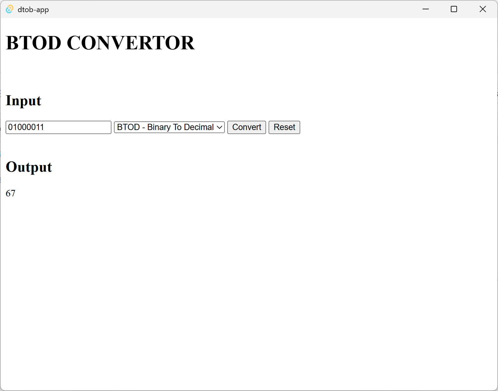
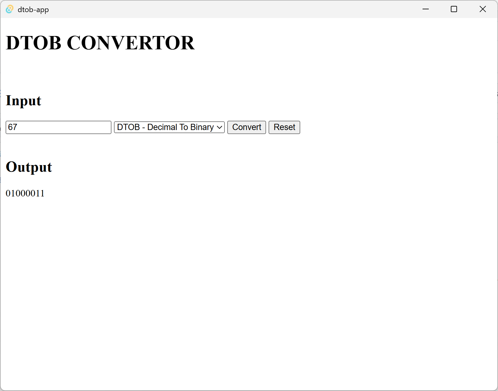
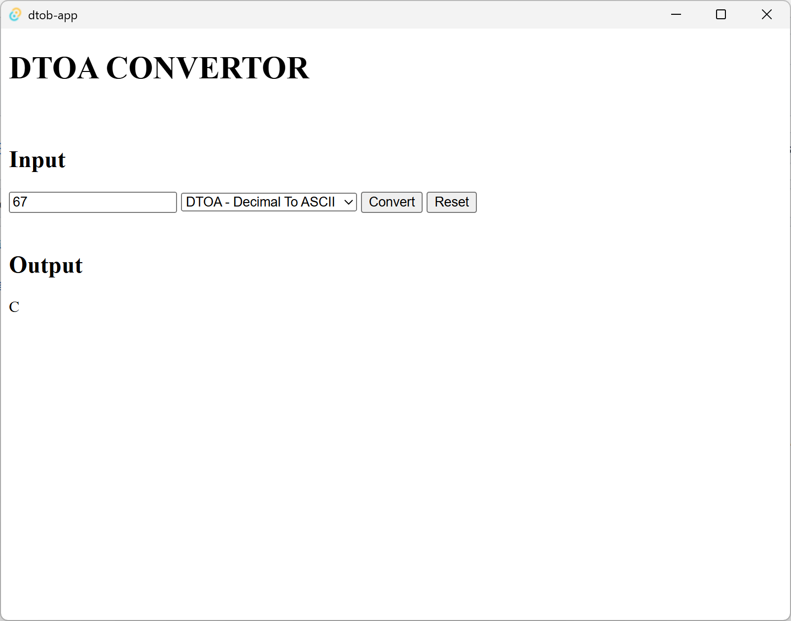
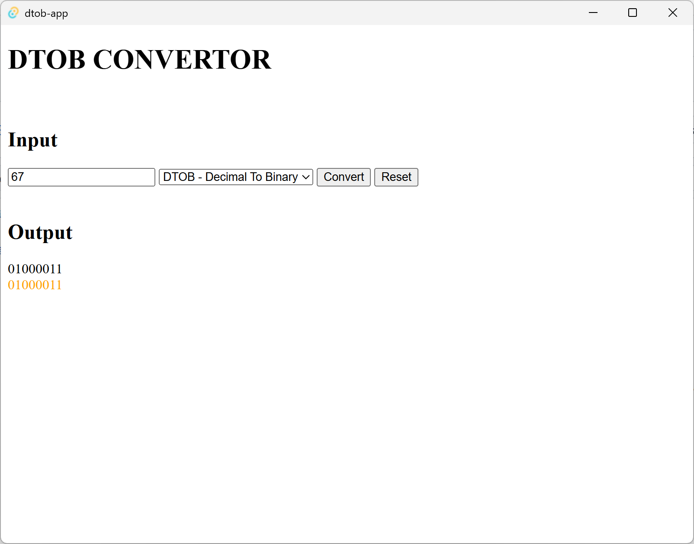
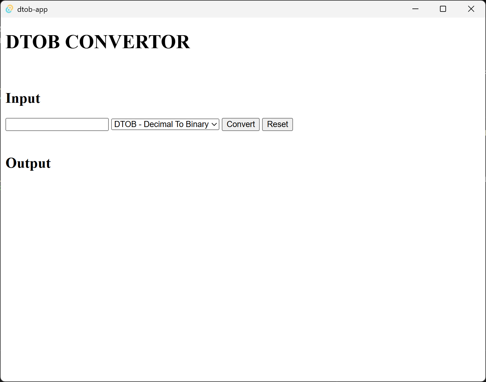

<h1 align="center">DTOB - Decimal to Binary Program<h1>

## Protocols
*Protocols are the different modes you can select*
- DTOB: Converts a decimal number (0-255) to a 8 bit binary number.
- BTOD: Converts a binary value to a decimal number
- DTOA: Converts a decimal number to an ASCII character ; *Only support decimals (65-255) as of now, will add (1-64) support later.*

## Binary To Decimal

## Decimal To Binary

## Decimal To ASCII

## Error example

_When you enter in a duplicate of a previous input, it will highlight the output in yellow to signify to you it has already been duplicate_

## Resetting

__When you click reset, it will reset your history, and your input field, along with the output field.__

# Want to help development?

## How you can help
- Contributing to repo by fixing bugs or bringing up issues in logic(__Make sure to write up a ticket on the github issue board!__)
- Breaking the app; A good way you can help me is by finding bugs in the main logic. Whether you look at the source code or you mess with the app directly all help is appreciated. __Make sure to write up a bug report in the issues page!__

## Contact Me!
**Email** - foxyovich@gmail.com

**Discord** - atlerrino

# Tech Stack
- Tauri 2.0
- HTML, CSS, Javascript
- Node JS
- Rust (Cause of tauri duh)

# TO-DO
- CSS styling
- binary to ascii protocol
